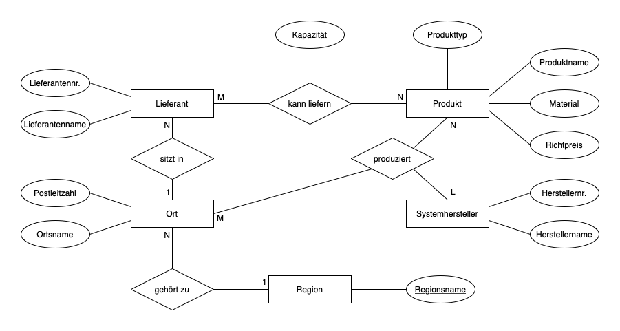

## <em style="color: #ff2c2d; font-style: normal">Entity-Relationship-Modell</em>

---

### Entity-Relationship-Modell

- konzeptuelles Datenmodell
- basiert auf dem Begriff der <q style="font-style: normal">Entität</q>
- bietet grafische Notation (sogenannte Entity-Relationship-Diagramme, ERD)

---

#### Beispiel: Lieferanteninformation (Kern-Bausch, Jeckle (2001))

<ol style="font-size: 0.8em">
    <li>
        Ein <strong>Lieferant</strong> hat
        <ul>
            <li>eine eindeutige Nummer,</li>
            <li>einen eindeutigen Namen und</li>
            <li>einen Firmensitz, der zu einer Region gehört.</li>
        </ul>
    </li>
    <li class="fragment">
        Ein <strong>Produkt</strong> hat
        <ul>
            <li>einen eindeutigen Produkttyp,</li>
            <li>einen Namen,</li>
            <li>eine optionale Materialangabe und</li>
            <li>einen Richtpreis.</li>
        </ul>
    </li>
    <li class="fragment">
        Ein <strong>Lieferant</strong> kann von einem <strong>Produkt</strong> eine maximale Menge (Kapaz) liefern.
    </li>
    <li class="fragment">
        Ein <strong>Systemhersteller</strong> produziert <strong>Produkte</strong> an <strong>Orten</strong>.
    </li>
</ol>

---

#### Grundbegriffe des Entity-Relationship-Modells

<table style="font-size:0.5em">
    <thead>
        <tr>
            <th style="border-style: none">Grundbegriff</th>
            <th style="border-style: none">Definition</th>
            <th style="border-style: none">Beispiel</th>
            <th style="border-style: none">grafische Darstellung</th>
        </tr>
    </thead>
    <tbody>
        <tr class="fragment">
            <td style="border-style: none">Entität</td>
            <td style="border-style: none">wohlunterscheidbares Konzept der Miniwelt; existiert physisch oder gedanklich</td>
            <td class="fragment" style="border-style: none">Lieferant <q>Yilmaz GmbH</q>, Produkt <q>F03</q></td>
            <td class="fragment" style="border-style: none"><em>wird nicht dargestellt</em></td>
        </tr>
        <tr class="fragment">
            <td style="border-style: none">Entitätstyp</td>
            <td style="border-style: none">Zusammenfassung ähnlicher Entitäten</td>
            <td class="fragment" style="border-style: none">Lieferant, Ort, Produkt, Region, Systemhersteller</td>
            <td class="fragment" style="border-style: none">Rechteck mit Name</td>
        </tr>
        <tr class="fragment">
            <td style="border-style: none">Beziehung <em>(relationship)</em></td>
            <td style="border-style: none">benannte Beziehung zwischen Entitäten</td>
            <td class="fragment" style="border-style: none">Lieferant <q>Yilmaz GmbH</q> kann max. 50 Einheiten des  Produkts <q>F03</q> liefern.</td>
            <td class="fragment" style="border-style: none"><em>wird nicht dargestellt</em></td>
        </tr>
        <tr class="fragment">
            <td style="border-style: none">Beziehungstyp <em>(relationship type)</em></td>
            <td style="border-style: none">Zusammenfassung ähnlicher Beziehungen; analog zu den Entitätstypen</td>
            <td class="fragment" style="border-style: none">gehört zu, kann liefern, produziert, sitzt in</td>
            <td class="fragment" style="border-style: none">Rhombus mit Name, Linien zu den Entitätstypen</td>
        </tr>
    </tbody>
</table>

---

#### Warnhinweis zum Sprachgebrauch <!-- .element style="color: #ff2c2d; font-style: normal" --> 

- Häufig wird von <q style="font-style: normal">Entität</q> gesprochen, 
  obwohl eigentlich <q style="font-style: normal">Entitätstyp</q> gemeint ist.
- Häufig wird von <q style="font-style: normal">Beziehung</q> gesprochen, 
  obwohl eigentlich <q style="font-style: normal">Beziehungstyp</q> gemeint ist.

---

#### Weitere Grundbegriffe des Entity-Relationship-Modells

<table style="font-size:0.5em">
    <thead>
        <tr>
            <th style="border-style: none">Grundbegriff</th>
            <th style="border-style: none">Definition</th>
            <th style="border-style: none">Beispiel</th>
            <th style="border-style: none">grafische Darstellung</th>
        </tr>
    </thead>
    <tbody>
        <tr class="fragment">
            <td style="border-style: none">Attribut</td>
            <td style="border-style: none">atomare Eigenschaft der Entitäten oder Beziehungen eines Typs</td>
            <td class="fragment" style="border-style: none">Herstellername, Herstellernr., Kapazität, Lieferantenname, Lieferantennr., …</td>
            <td class="fragment" style="border-style: none">Oval mit Name, Linie zum Entitätstyp</td>
        </tr>
        <tr class="fragment">
            <td style="border-style: none">Schlüsselkandidat</td>
            <td style="border-style: none">analog zum relationalen Datenmodell</td>
            <td class="fragment" style="border-style: none">Lieferantenname</td>
            <td class="fragment" style="border-style: none"><em>wird nicht dargestellt</em></td>
        </tr>
        <tr class="fragment">
            <td style="border-style: none">Primärschlüssel</td>
            <td style="border-style: none">analog zum relationalen Datenmodell</td>
            <td class="fragment" style="border-style: none">Herstellernr., Lieferantennr., Postleitzahl, Produkttyp, Regionenname</td>
            <td class="fragment" style="border-style: none">Unterstreichung</td>
        </tr>
        <tr class="fragment">
            <td style="border-style: none">Kardinalität</td>
            <td style="border-style: none">definiert, wie viele Entities eines Typs maximal mit wie vielen Entities eines anderen Typs in Beziehung stehen können</td>
            <td class="fragment" style="border-style: none">1, L, M, N</td>
            <td class="fragment" style="border-style: none">Zeichen am Entitätstyp-Ende der Linie</td>
        </tr>
    </tbody>
</table>

---

#### Beispiel: Konzeptuelles Schema der Lieferanteninformation gemäß Entity-Relationship-Modell

<figure>
    
    <figcaption style="font-size: 0.5em">Quelle: Skizze des Dozenten</figcaption>
</figure>
