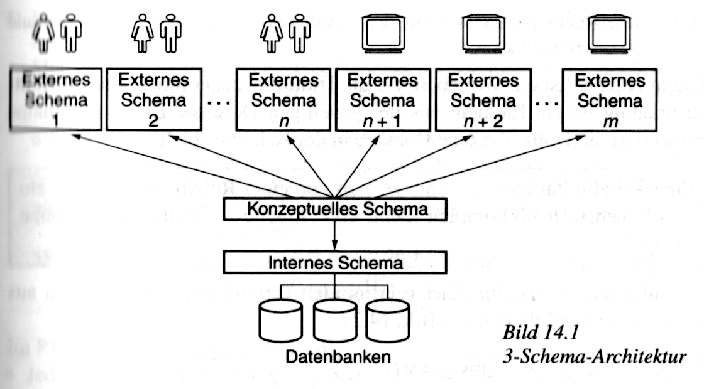

## Zuletzt in der Datenbanken-Vorlesung

---

### Grundbegriffe

- Datenbank *(database, DB)*
- Datenbankverwaltungssystem *(database management system, DBMS)*
- Datenbanksystem *(database system, DBS)*
- Schema *(schema)*
- konzeptuelles Schema *(conceptual schema)*

---

### Anforderungen an Datenbankverwaltungssysteme (Auszug)

- **Physische Datenunabhängigkeit**
    - Ort und Art der physischen Abspeicherung dürfen Anwendungen nicht beeinflussen.
- **Logische Datenunabhängigkeit**
    - Informationserhaltende Änderungen der Datenbanklogik dürfen Anwendungen nicht beeinflussen.
- **Sichten auf die Datenbank**
- **Rechtevergabe**

---

### Drei-Schema-Architektur

- **externes Schema**
    - beschreibt
        - benötigte Sicht externer Nutzer:innen und Applikationen
        - die ihnen eingeräumten Rechte
    - leitet sich aus dem *konzeptuellen Schema* ab
- **internes Schema**
    - beschreibt
        - physische Abspeicherung
        - Zugriffsorganisation
    - leitet sich aus dem *konzeptuellen Schema* ab

Anmerkungen:

- physische Abspeicherung und Zugriffsorganisation später im Semester
- heute mehr zum konzeptuellen Schema

---

#### Visualisierung der Drei-Schema-Architektur

<figure>
    
    <figcaption style="font-size: 0.5em">Quelle: Kern-Bausch, Jeckle (2001)</figcaption>
</figure>

Anmerkungen:

- *mehrere* externe Schemata
    - für verschiedene Gruppen menschlicher Nutzer:innen
    - für verschiedene Applikationen
- *ein* internes Schema
- Alle werden aus dem konzeptuellen Schema abgeleitet.
