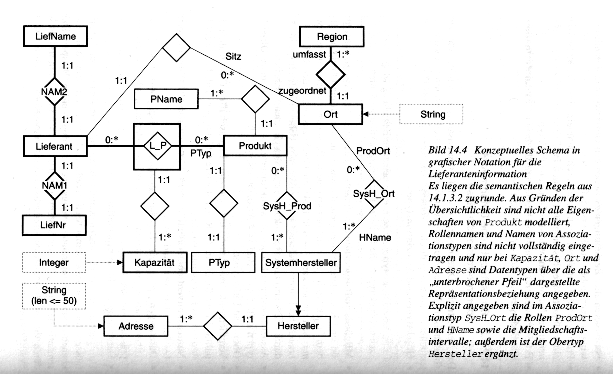

## <em style="color: #ff2c2d; font-style: normal">Semantisches Datenmodell der Informationsanalyse</em>

---

### Informationsanalyse

- systematisches Vorgehen zur Entwicklung und Beschreibung des konzeptuellen Schemas
- besteht aus mehreren Vorgehensschritten

---

#### Vorgehensschritte der Informationsanalyse

1. Sammle alle relevanten **Objekte**.
2. Fasse Objekte zu **Objekttypen** zusammen.
3. Formuliere alle **Beziehungen** zwischen den Objekttypen.
4. Sammle für alle Objekttypen alle **Eigenschaften** der Objekte.
5. Lege für alle Objekttypen eine **Namenskonvention** fest, d.&thinsp;h. eine eindeutige Benennung der Objekte.
6. Erfasse **Metainformationen**, 
   d.&thinsp;h. weitere semantische Gesetzmäßigkeiten 
   (z.&thinsp;B. Bedingungen oder Konsistenzregeln).

---

### Semantisches Datenmodell der Informationsanalyse

- konzeptuelles Datenmodell für das konzeptuelle Schema als Ergebnis der Informationsanalyse
- bietet textuelle und grafische Notation

---

#### Grundbegriffe des semantischen Datenmodells der Informationsanalyse

- Objekttyp
- Obertyp und Untertyp
- Datentyp
    - physische Repräsentation eines Objekttyps
- atomarer Objekttyp
- Assoziationstyp
    - benannte Beziehung zwischen *n≥2* Objekttypen, 
      die in dieser Beziehung bestimmte Rollen spielen und
      bestimmte Kardinalitäten haben
- Eigenschaft
- Namenskonvention
    - identifizierende Eigenschaft

---

#### Beispiel für ein konzeptuelles Schema im semantischen Datenmodell der Informationsanalyse

##### Semantische Regeln der Lieferanteninformation

<ol style="font-size: 0.7em">
    <li>
        Ein <strong>Lieferant</strong> hat
        <ul>
            <li>eine eindeutige Nummer,</li>
            <li>einen eindeutigen Namen und</li>
            <li>einen Firmensitz, der zu einer Region gehört.</li>
        </ul>
    </li>
    <li>
        Ein <strong>Produkt</strong> hat
        <ul>
            <li>einen eindeutigen Produkttyp,</li>
            <li>einen Namen,</li>
            <li>eine optionale Materialangabe und</li>
            <li>einen Richtpreis.</li>
        </ul>
    </li>
    <li>
        Ein <strong>Lieferant</strong> kann von einem <strong>Produkt</strong> eine maximale Menge (Kapaz) liefern.
    </li>
    <li>
        Ein <strong>Systemhersteller</strong> produziert <strong>Produkte</strong> an einem <strong>Ort</strong>.
    </li>
</ol>

---

##### Konzeptuelles Schema in grafischer Notation des semantischen Datenmodells der Informationsanalyse

<figure>
    
    <figcaption style="font-size: 0.5em">Quelle: Kern-Bausch, Jeckle (2001)</figcaption>
</figure>

---

##### Grafische Darstellung der Grundbegriffe des semantischen Datenmodells der Informationsanalyse

<table style="font-size:0.5em">
    <thead>
        <tr>
            <th style="border-style: none">Grundbegriff</th>
            <th style="border-style: none">grafische Darstellung</th>
            <th style="border-style: none">Instanzen</th>
        </tr>
    </thead>
    <tbody>
        <tr>
            <td style="border-style: none">Objekttypen</td>
            <td style="border-style: none">Rechtecke</td>
            <td style="border-style: none">Adresse, Hersteller, Kapazität, Lieferant, LiefName, LiefNr, Ort, PName, Produkt, PTyp, Region, Systemhersteller</td>
        </tr>
        <tr>
            <td style="border-style: none">binäre Assoziationstypen</td>
            <td style="border-style: none">Rhomben, Name im Rhombus (unvollständig), Rollen und Kardinalitäten (unvollständig) an den Verbindungslinien zu den Objekttypen</td>
            <td style="border-style: none">NAM1, NAM2, SysH_Ort, SysH_Prod</td>
        </tr>
        <tr>
            <td style="border-style: none">strukturierte binäre Assoziationstypen</td>
            <td style="border-style: none">Rhomben in Rechtecken, Name im Rhombus, Rollen und Kardinalitäten (unvollständig) an den Verbindunslinien zu den Objekttypen</td>
            <td style="border-style: none">L_P</td>
        </tr>
        <tr>
            <td style="border-style: none">Obertypen und Untertypen</td>
            <td style="border-style: none">gerichteter Pfeil mit Doppelspitze</td>
            <td style="border-style: none">Hersteller und Systemhersteller</td>
        </tr>
        <tr>
            <td style="border-style: none">Datentypen</td>
            <td style="border-style: none">gestrichelte Rechtecke mit gestrichelten Pfeilen mit einfacher Spitze</td>
            <td style="border-style: none">Integer, String, String (len<=50)</td>
        </tr>
    </tbody>
</table>
